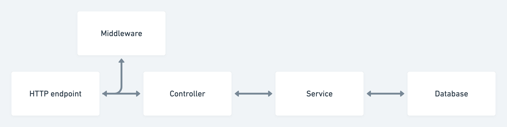

# Build a REST API with Node.js, Mongoose & TypeScript

Note : Make sure you add .env to your .gitignore before pushing any changes to your repository. You will also want to generate new public & private keys

# run yarn dev

## Who is this tutorial for?
* Junior to mid-level developers
* Anyone interested in building REST APIs with TypeScript

## What you will need
* A running instance of MongoDB
* Postman
* An IDE or text editor (VS Code)
* A web browser
* A package manager such as NPM or Yarn
* Node.js installed

## What next?
* Testing the API with Jest
* Build a React.js user interface
* Add Prometheus metrics to the API
* Deploy the API with Caddy & Docker
* Add Google OAuth

## Concepts
* REST API principals
    * CRUD
    * HTTP methods
* JWT & refresh tokens
* Request validation
## Technologies
* Node.js
* MongoDB with Mongoose
* TypeScript
* Express.js & Express.js middleware
* Zod validation

## Data flow

## Access & refresh token flow

# Deployment

## What will we use
* Docker (image)
* docker-compose (container)
* Caddy - Web server
* DigitalOcean

Note: You will need Docker installed locally if you want to test your Docker configutation

